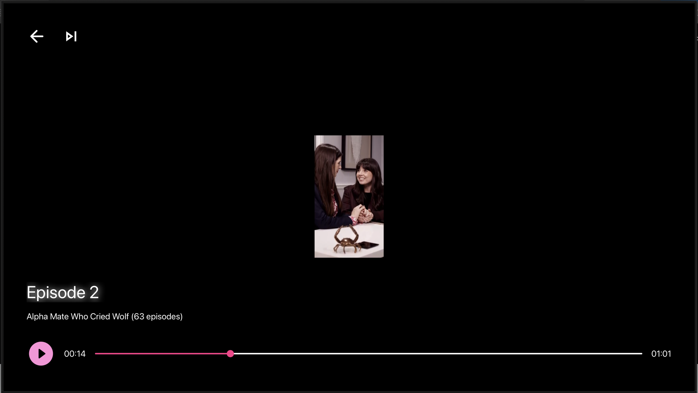

# TV App

This is a new React Native project designed specifically for **Android TV** and **Apple TV** platforms. The app enables seamless navigation and media playback with intuitive remote control support.

## Screenshots

<div style="display: flex; flex-wrap: wrap; gap: 10px;">
  <div>
    
    <p>Home Screen</p>
  </div>
  <div>
    
    <p>Playback Screen</p>
  </div>
</div>

### Home Screen

The home screen provides a list of media options, along with intuitive navigation using TV remotes.

### Playback Screen

The playback screen allows users to play, pause, and seek through media content with easy-to-use controls.

## Getting Started

> **Note**: Make sure you have completed the [React Native - Environment Setup](https://reactnative.dev/docs/environment-setup) instructions up to the "Creating a new application" step, before proceeding.

### Step 1: Install Dependencies

1. First, install the necessary dependencies using Yarn:

```bash
yarn install
```

2. After that, navigate to the ios directory and install the iOS dependencies:

```bash
cd ios
pod install
cd ..
```

### Step 2: Running the Application

Now that the dependencies are installed, you can start the application.

```bash
yarn start
```

### For iOS

1. Make sure you have the **iOS Simulator** running with iOS 17.0 or 18.0. Using other versions may result in errors in the video player (though it works fine on real devices).

2. Run the following command to launch the iOS app:

```bash
yarn ios
```

### For Android

1. Make sure you have the Android TV Emulator launched.

2. Run the following command to launch the Android app:

```bash
yarn android
```

## Tech Stack

This app is built using the following technologies:

- **React Native:** For building cross-platform mobile apps.
- **Redux Toolkit:** For managing global state, including character data, guesses, and app settings.
- **TypeScript:** For type-safe JavaScript.
- **React Navigation:** For navigating between screens (Bottom Tabs).
- **React Native Video:** For video.
